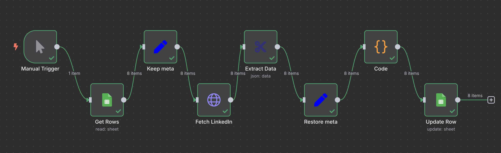

# n8n LinkedIn → Google Sheets Workflow

  

## Опис
Цей n8n-воркфлоу автоматично зчитує `LinkedInHandle` з Google Sheets, витягує дані компанії з LinkedIn (назва, індустрія, локація, вебсайт, розмір компанії, спеціалізації, головний офіс, кількість підписників) і оновлює відповідний рядок у тій самій Google-таблиці.

## Кроки
1. **Manual Trigger** — ручний запуск воркфлоу.
2. **Get Rows** — читає всі рядки з колонки `LinkedInHandle` у Google Sheets.
3. **Keep meta** — зберігає `LinkedInHandle` та номер рядка у поле `meta`.
4. **Fetch LinkedIn** — робить HTTP-запит до сторінки компанії на LinkedIn.
5. **Extract Data** — витягує дані через CSS-селектори:
   - `h1.top-card-layout__title` — Company Name
   - `h2.top-card-layout__headline` — Industry
   - `h3.top-card-layout__first-subline` — Location + followers
   - `div[data-test-id=\"about-us__website\"] a` — Website (`href`)
   - `div[data-test-id=\"about-us__size\"] dd` — Company Size
   - `div[data-test-id=\"about-us__specialties\"] dd` — Specialties
   - `div[data-test-id=\"about-us__headquarters\"] dd` — Headquarters
6. **Code** — розділяє поле `Location` на чисту локацію і кількість підписників (`Followers`).
7. **Restore meta** — відновлює вихідні `LinkedInHandle` та номер рядка.
8. **Update Row** — оновлює Google Sheets за номером рядка, не створюючи нових рядків.

## Встановлення
1. Імпортуйте JSON цього воркфлоу у ваш n8n (*Import from File...*).
2. Налаштуйте креденшли:
   - **Google Service Account**: доступ до Google Sheets API.
   - **Header Auth**: токени або cookies для LinkedIn.
3. Створіть у таблиці необхідні колонки:
   - `LinkedInHandle`
   - `Company Name`, `Industry`, `Location`, `Followers`, `Website`, `Company Size`, `Specialties`, `Headquarters`
4. Збережіть і запустіть **Manual Trigger**.

## Посилання на відео:
`https://drive.google.com/file/d/1g5hI_bA1T8OtdUCCDIviDaCGmjL1ku-F/view?usp=sharing`